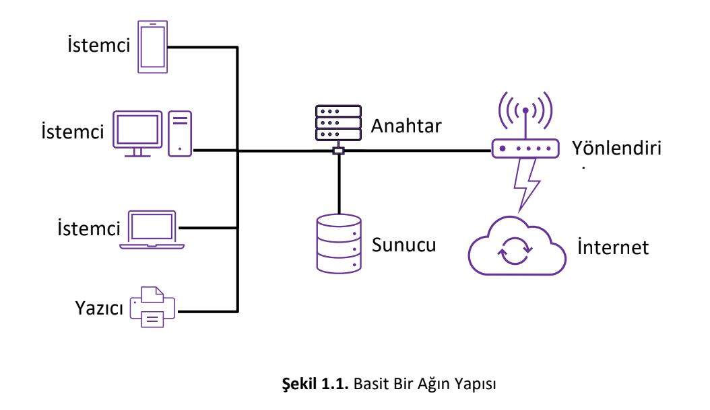
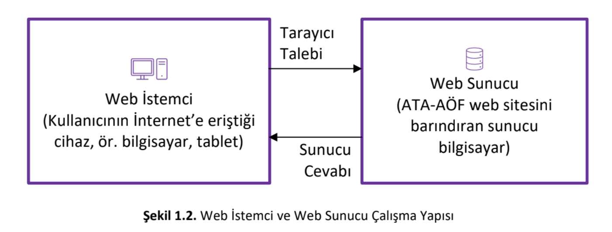
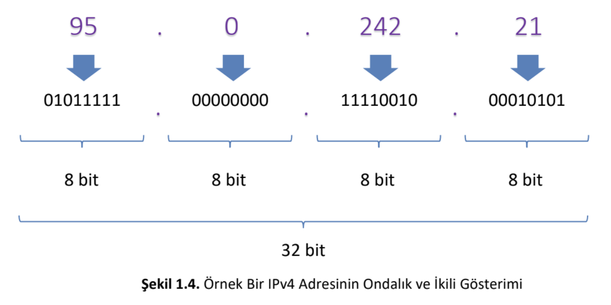

# WEB TASARIMI, İNTERNET MİMARİSİ VE DİJİTAL İLETİŞİM TEKNOLOJİLERİ ÜZERİNE KAPSAMLI BİR İNCELEME

## 1. Yönetici Özeti ve Giriş
Dijital çağın şafağında, bilgiye erişim ve iletişim yöntemleri, insanlık tarihinde eşi görülmemiş bir hızla dönüşüme uğramıştır. Bu dönüşümün merkezinde yer alan İnternet ve Web teknolojileri, modern toplumun sosyo-ekonomik, kültürel ve politik dinamiklerini yeniden şekillendiren temel belirleyiciler haline gelmiştir. Bu rapor, Atatürk Üniversitesi Açıköğretim Fakültesi ders materyalleri ve güncel küresel araştırma verileri ışığında, web tasarımının temellerini, internetin tarihsel ve teknik altyapısını, iletişim protokollerini ve dijital ekosistemi düzenleyen standartları derinlemesine incelemektedir.

Raporun temel amacı, web tasarımına giriş yapan bireyler ve profesyoneller için sadece "kod yazma" becerisinin ötesinde, üzerinde çalışılan platformun—yani internetin—nasıl işlediğine dair bütüncül bir vizyon sunmaktır. Bir web sayfasının tarayıcıda görüntülenmesi, arka planda milisaniyeler içinde gerçekleşen karmaşık bir protokoller zinciri, sunucu-istemci diyalogları ve veri paketleme süreçlerinin bir sonucudur.

## 2. İnternetin Tarihsel Evrimi ve Küresel Gelişimi
İnternetin tarihsel köklerini anlamak, bugünkü merkeziyetsiz yapısını ve dayanıklılığını kavramak için kritik bir öneme sahiptir. İnternet, tek bir mucidin eseri değil, on yıllara yayılan kolektif bir mühendislik ve vizyonerliğin ürünüdür.

### 2.1. İnternet Öncesi Vizyon ve Teorik Temeller
1960'lı yılların başında, bilgisayarlar oda büyüklüğünde, hantal ve birbirine bağlı olmayan cihazlardı. MIT'den J.C.R. Licklider, 1962 yılında ortaya attığı "Galaktik Ağ" (Galactic Network) kavramıyla, bilgisayarların küresel bir ağ üzerinden birbirine bağlanarak veri ve program paylaşabileceği vizyonunu ortaya koydu. Eş zamanlı olarak, Leonard Kleinrock 1961 yılında yayınladığı "Packet Switched Network" makalesiyle, verinin küçük paketlere bölünerek iletilmesinin teorik altyapısını kurdu.

### 2.2. ARPANET: Soğuk Savaşın Dijital Mirası
İnternetin somut olarak doğuşu, ABD Savunma Bakanlığı'na bağlı İleri Araştırma Projeleri Ajansı (ARPA) tarafından finanse edilen ARPANET projesiyle gerçekleşmiştir. 1969 yılında hayata geçirilen ARPANET, dünyanın ilk paket anahtarlamalı ağı olarak tarihe geçti. İlk bağlantı, California Üniversitesi Los Angeles (UCLA), Stanford Araştırma Enstitüsü, California Üniversitesi Santa Barbara ve Utah Üniversitesi arasında kurulan dört düğümlü bir yapı ile sağlandı.

### 2.3. Protokollerin Birleşimi ve Modern İnternetin Doğuşu
1970'ler boyunca farklı ağlar (ARPANET, ALOHAnet, SATNET vb.) kendi dillerini konuşuyor ve birbirleriyle doğrudan iletişim kuramıyordu. Bu "Babil Kulesi" sorununu çözmek için Vinton Cerf ve Bob Kahn, TCP/IP (Transmission Control Protocol/Internet Protocol) mimarisini geliştirdi.

1 Ocak 1983 tarihinde ARPANET, eski NCP protokolünü terk ederek resmen TCP/IP protokolüne geçiş yaptı. Bu tarih, modern internetin resmi doğum günü olarak kabul edilir. TCP/IP, farklı donanım ve yazılım altyapılarına sahip ağların ortak bir dilde konuşmasını sağlayarak, yerel ağların küresel bir "ağların ağı"na dönüşmesini mümkün kıldı.

### 2.4. Web'in (WWW) Ortaya Çıkışı ve Kitleselleşme
İnternet 1980'lerde var olsa da, kullanımı teknik bilgi gerektiren komut satırı arayüzleriyle sınırlıydı. İnternetin halka inmesini sağlayan devrim, 1989 yılında İsviçre'deki CERN laboratuvarlarında gerçekleşti. Tim Berners-Lee, bilgiye erişimi kolaylaştırmak için hiper metin (hypertext) tabanlı bir sistem önerdi. 1991 yılında ilk web sitesinin yayınlanmasıyla World Wide Web (WWW) doğdu.   

Burada "İnternet" ve "Web" arasındaki ayrımı netleştirmek gerekir. İnternet, bilgisayarları birbirine bağlayan fiziksel altyapı ve taşıma mekanizmasıdır (yollar ve otoyollar). Web ise bu altyapı üzerinde çalışan, bilgi paylaşımını sağlayan yazılımsal bir hizmettir (bu yollarda taşınan kargo).   

Web'in patlama yapması, 1993 yılında Mosaic adlı grafik tabanlı tarayıcının geliştirilmesiyle oldu. Mosaic, metin ve görselleri aynı sayfada gösterebiliyor ve fare ile tıklanabilir bağlantılar sunuyordu. Bu gelişme, interneti sadece akademisyenlerin kullandığı bir araç olmaktan çıkarıp, görsel ve etkileşimli bir kitle iletişim aracına dönüştürdü.

### 2.5. Türkiye'de İnternetin Gelişimi
Türkiye'nin internet serüveni, dünyadaki gelişmeleri yakından takip ederek başlamıştır. İlk geniş alan ağı bağlantısı, 1986 yılında kurulan TÜVEKA ile gerçekleşmiştir. Ancak gerçek anlamda internet bağlantısı, 12 Nisan 1993 tarihinde ODTÜ Bilgi İşlem Daire Başkanlığı sunucuları üzerinden Washington'daki NSFNET'e yapılan bağlantı ile sağlanmıştır. 1996 yılında TURNET projesi ile ticari servis sağlayıcıların hizmetine açılmış ve son kullanıcıya ulaşmaya başlamıştır.

## 3. Dijital 2025: Küresel İnternet Kullanımı ve İstatistikler
2025 yılı itibarıyla, dünya genelindeki internet kullanıcı sayısı yaklaşık 5.56 ile 6 milyar aralığına ulaşmış durumdadır. Bu rakam, küresel nüfusun yaklaşık %67.9'una tekabül etmektedir. Sadece 2024 ile 2025 arasında internete yeni katılan kullanıcı sayısı 240 milyonun üzerindedir.

İnternet erişiminde mobil cihazların hakimiyeti 2025 yılında da artarak devam etmektedir. Dünya genelinde 5.78 milyar mobil telefon kullanıcısı bulunmakta, bu da dünya nüfusunun %70.5'ine denk gelmektedir. 5G teknolojisi, mobil geniş bant aboneliklerinin yaklaşık üçte birini (3 milyar) oluşturmakta ve dünya nüfusunun %55'ini kapsama alanına almaktadır. Ancak, 5G'ye erişimde ciddi bir eşitsizlik göze çarpmaktadır. Yüksek gelirli ülkelerde nüfusun %84'ü 5G kapsamındayken, düşük gelirli ülkelerde bu oran sadece %4 seviyesindedir.

Sosyal medya platformları, internet kullanımının ana motivasyonlarından biri olmayı sürdürmektedir. 2025 verilerine göre 5.66 milyar insan sosyal medya kullanıcısıdır. Küresel nüfusun %63.9'u sosyal medyada aktif olup, günlük ortalama kullanım süresi 2 saat 21 dakikayı bulmaktadır.   

## 4. Ağ Mimarisi ve Donanım Altyapısı
Web sayfalarının ve dijital hizmetlerin çalışabilmesi için gerekli olan fiziksel ve mantıksal altyapı "Bilgisayar Ağları" olarak tanımlanır. Ağ, en basit tanımıyla, kaynak paylaşımı ve iletişim amacıyla birbirine bağlanmış birden fazla cihazın oluşturduğu yapıdır.   

### 4.1. Ağın Temel Bileşenleri
Bir ağın işlevsel olabilmesi için belirli donanım ve yazılım bileşenlerinin bir arada çalışması gerekir:

- **İstemci (Client):** Ağ üzerinden hizmet veya veri talep eden son kullanıcı cihazlarıdır (masaüstü bilgisayarlar, laptoplar, tabletler, akıllı telefonlar).
- **Sunucu (Server):** Ağdaki kaynakları barındıran ve istemcilerden gelen isteklere yanıt veren yüksek kapasiteli bilgisayarlardır.
- **Ağ Arabirim Kartı (NIC):** Cihazların fiziksel olarak ağa bağlanmasını sağlayan donanım birimidir (Ethernet girişi, Wi-Fi çipi).
- **İletişim Ortamları:** Bakır kablolar (Ethernet), fiber optik kablolar veya kablosuz radyo dalgaları (Wi-Fi, 5G).
- **Ağ Cihazları:** Anahtar (Switch) yerel ağ içindeki cihazları birbirine bağlar; Yönlendirici (Router) farklı ağları birbirine bağlar.

### 4.2. İstemci-Sunucu (Client-Server) Mimarisi
Modern internetin çalışma prensibi büyük oranda İstemci-Sunucu mimarisine dayanır. Kullanıcı tarayıcısında bir adrese gitmek istediğinde, istemci (tarayıcı) sunucuya bir "İstek" (Request) gönderir. Sunucu bu isteği işler, veritabanından gerekli bilgileri çeker ve bir "Yanıt" (Response) döner. Sunucu tarafı, veritabanı yönetimi, iş mantığı ve güvenlikten sorumlu iken; istemci tarafı, verinin kullanıcıya sunulması ve arayüz etkileşimlerinden sorumludur.

### 4.3. Ağ Türleri ve Topolojileri
Ağlar, kapsadıkları coğrafi alana göre sınıflandırılır: **LAN** (Yerel Alan Ağı), **WAN** (Geniş Alan Ağı), **WLAN** (Kablosuz LAN), **VLAN** (Sanal LAN).

Ağdaki cihazların birbirine nasıl bağlandığını belirleyen geometrik düzene "Topoloji" denir. Günümüzde en yaygın kullanılan topoloji, ofis ve ev ağlarında görülen Yıldız topolojisi ve internetin omurgasında kullanılan Örgü (Mesh) topolojisidir.

## 5. İletişim Protokolleri: Dijital Dünyanın Dili
İnternet protokolleri, bilgisayarların ve diğer cihazların ağ üzerinden birbirleriyle iletişim kurabilmesini sağlayan kurallar ve standartlar bütünüdür. Farklı amaç ve işlevler için farklı protokoller mevcuttur:

- **TCP/IP:** İnternet'in temel protokol kümesi; cihazların veri paketlerini adresleyip güvenli şekilde iletmesini sağlar.
- **HTTP:** Web sayfalarının tarayıcı ve sunucu arasında iletilmesini sağlar; durumsuz (stateless) bir protokoldür.
- **HTTPS:** HTTP'nin şifrelenmiş sürümü; bankacılık, e-ticaret ve kullanıcı girişi gibi güvenli iletişim gerektiren işlemlerde kullanılır.
- **FTP:** Bilgisayarlar arasında dosya aktarımı yapar; web geliştiricileri dosya yüklemek veya indirmek için kullanır.
- **SMTP:** E-posta gönderimini düzenler; e-posta istemcisinden sunucuya iletimi sağlar.
- **POP3:** E-postaları sunucudan indirir ve çoğu zaman siler; tek cihaz üzerinden erişim için uygundur.
- **IMAP:** E-postalara sunucu üzerinde erişim sağlar; çoklu cihazdan senkronize kullanım için tercih edilir.

İnternet protokolleri günümüzde web teknolojilerini kullanan birçok kişinin farkında olmadan faydalandığı standartlardır. Örneğin, bir öğrenci ders notlarına erişmek, ödevini yüklemek ve danışman hocasına e-posta göndermek için bilgisayarını kullanırken birçok protokol devreye girer. Tarayıcıya bir web adresi yazıldığında HTTP isteği gönderilir, giriş yapıldığında HTTPS üzerinden şifrelenmiş bağlantı sağlanır, dosya yükleme işlemlerinde FTP kullanılır ve e-posta gönderiminde SMTP protokolü devreye girer.

### 5.1. TCP/IP Protokol Kümesi
TCP/IP, İnternet'in temelini oluşturan iletişim protokolü kümesidir. İletim Kontrol Protokolü (TCP), verileri küçük paketlere bölerek karşı tarafa güvenli bir şekilde iletilmesini sağlar ve paketlerin doğru sırada birleştirilmesini garanti eder. İnternet Protokolü (IP) ise bu veri paketlerinin adreslenmesinden ve doğru hedefe yönlendirilmesinden sorumludur. Birlikte çalıştıklarında TCP/IP, farklı türdeki bilgisayarların ve ağların birbiriyle uyumlu şekilde haberleşmesini mümkün kılar. TCP/IP'nin esnek ve ölçeklenebilir yapısı, İnternet'in hızlı büyümesinin ve küresel ölçekte benimsenmesinin en önemli nedenlerinden biridir.

### 5.2. Web Protokolleri: HTTP ve HTTPS
**HTTP (Hypertext Transfer Protocol):** Türkçeye Hiper Metin Transfer Protokolü olarak çevrilen HTTP, web üzerinde metin, görsel, ses, video ve diğer çoklu ortam dosyalarının aktarılmasını sağlayan kurallar bütünüdür. Web tarayıcıları ile web sunucuları arasındaki iletişim genellikle bu protokol üzerinden gerçekleşir. Bir kullanıcı tarayıcısına bir web adresi yazdığında veya bir bağlantıya tıkladığında, tarayıcı sunucuya bir HTTP isteği gönderir. Sunucu bu isteği alır, gerekli işlemleri yapar ve talep edilen sayfa ile ilgili dosyaları tarayıcıya geri gönderir. HTTP "durumsuz" (stateless) bir protokoldür ve varsayılan olarak 80 numaralı portu kullanır.

**HTTPS (Hypertext Transfer Protocol Secure):** Güvenli Hiper Metin Aktarım Protokolü, HTTP'nin şifreleme ve güvenlik mekanizmalarıyla güçlendirilmiş sürümüdür. HTTPS kullanıldığında, web tarayıcısı ile web sunucusu arasında aktarılan tüm veriler şifrelenir. Böylece üçüncü tarafların bu verileri ele geçirmesi veya değiştirmesi büyük ölçüde engellenir. Özellikle çevrimiçi bankacılık, e-ticaret işlemleri ve kullanıcı adı-parola ile giriş yapılan sistemlerde, HTTPS veri güvenliği ve kullanıcı gizliliğinin korunması açısından kritik öneme sahiptir. HTTPS kullanıldığında tarayıcı adres çubuğunun başında "https" ifadesi yer alır ve 443 numaralı portu kullanır.

### 5.3. E-Posta ve Dosya Transfer Protokolleri
**FTP (File Transfer Protocol):** Dosya Aktarım Protokolü, İnternet üzerindeki bilgisayarlar arasında dosya transferini mümkün kılan bir iletişim kural setidir. HTTP, web tarayıcılarının web sayfalarını görüntülemek için kullandığı bir protokol iken; FTP yalnızca dosyaların bir bilgisayardan diğerine aktarılmasına odaklanır. Özellikle web geliştiricileri, hazırladıkları web sayfası dosyalarını kendi bilgisayarlarından web sunucularına yüklemek veya sunucudan yerel bilgisayarlarına indirmek için FTP'den yararlanırlar.

**SMTP (Simple Mail Transfer Protocol):** Basit Posta Aktarım Protokolü, İnternet üzerinde e-posta iletimini sağlayan temel protokoldür. SMTP, bir e-posta istemcisinden gönderilen mesajın, ilgili posta sunucusuna ulaştırılmasını ve oradan alıcıya yönlendirilmesini düzenler. E-postaların gönderim aşamasında standart olarak kullanılan bu protokol, genellikle POP3 veya IMAP gibi protokollerle birlikte çalışır.

**POP3 (Post Office Protocol version 3):** Posta Ofisi Protokolü Sürüm 3, e-postaların sunucudan alınarak kullanıcının bilgisayarına indirilmesini sağlayan bir protokoldür. POP3 kullanan bir e-posta istemcisi, sunucudaki mesajları indirir ve çoğu durumda sunucudan siler. Bu nedenle POP3, özellikle tek bir cihaz üzerinden e-postalara erişen kullanıcılar için uygundur.

**IMAP (Internet Message Access Protocol):** İnternet Mesaj Erişim Protokolü, kullanıcıların e-postalarına doğrudan sunucu üzerinden erişmesini sağlayan bir protokoldür. POP3'ten farklı olarak, IMAP e-postaları indirip silmek yerine sunucuda saklar. Böylece kullanıcılar aynı e-posta hesabına birden fazla cihazdan (bilgisayar, tablet, akıllı telefon) senkronize biçimde erişebilir. Bu özelliğiyle IMAP, günümüzün çoklu cihaz kullanımına daha uygun, esnek ve yaygın tercih edilen bir e-posta protokolüdür.

## 6. İnternetin Adresleme Sistemi: IP ve DNS
İnternete bağlı her cihaz, ağ üzerindeki diğer cihazlarla doğru iletişim kurabilmek için benzersiz bir sayısal kimlik taşır. Bu kimlik IP adresi olarak adlandırılır. IP adresleri, genellikle dört gruplu sayısal diziler hâlinde ifade edilir ve her grup 0–255 aralığında bir değerden oluşur (ör. 95.0.242.21).

### 6.1. IP Adresleri: IPv4 ve IPv6 Geçişi
IP adresleri, doğrudan hatırlaması güç olduğundan, alan adları (ör. "atauni.edu.tr") ile ilişkilendirilir. Bu ilişkinin yönetimini sağlayan sisteme Alan Adı Sistemi (DNS) denir. DNS, kullanıcıların tarayıcıya yazdığı alan adını uygun IP adresine çevirerek web sitesine erişim sağlar. Örneğin, Atatürk Üniversitesi'nin web sitesi alan adı üzerinden erişildiğinde, DNS bu alan adını 95.0.242.21 IP adresine yönlendirir. Başka bir ifadeyle, tarayıcının adres çubuğuna alan adı yerine IP adresini yazarak da ilgili sayfaya erişim yapılabilir.

Günümüzde yaygın olarak kullanılan **IPv4**, 32 bitlik bir adresleme sistemi sunar. Bu yapı, yaklaşık 4.3 milyar farklı IP adresi oluşturmayı mümkün kılar. Elbette birçok adres özel (örneğin yerel ağlar veya sistem amaçları için) rezerve edildiğinden, gerçek kullanılabilir adres sayısı daha sınırlıdır. Buna rağmen dünya üzerindeki cihaz talebi, IPv4'ün sunduğundan fazlasını gerektirmektedir.

Bu eksikliği gidermek adına geliştirilen **IPv6**, 128 bitlik adresleme sistemi sunar. Böylece 2^128 yani neredeyse 340 desilyon benzersiz IP adresi üretilebilir. IPv6, IPv4 ile geriye dönük uyumlu olacak şekilde tasarlanmış olup, servis sağlayıcılar ve kullanıcılar arasında geçiş sürecine esneklik kazandırır.

**Tablo 6.1: IPv4 ve IPv6 Karşılaştırması**

| Özellik | IPv4 | IPv6 |
|---------|------|------|
| Adres Uzunluğu | 32-bit | 128-bit |
| Adres Formatı | Ondalık, dört sayı grubu (ör. 192.168.1.1) | Heksadesimal, sekiz grup (ör. 2001:0db8:85a3::8a2e:0370:7334) |
| Adres Kapasitesi | Yaklaşık 4,3 milyar adres | 2^128 (340 desilyon) adres |
| Kullanım Durumu | Hâlen yaygın, fakat yetersiz kalmaya başladı | Yeni standart, aşamalı olarak yaygınlaşıyor |
| Geriye Dönük Uyumluluk | Doğrudan yok | IPv4 ile uyumlu olacak şekilde tasarlandı |

### 6.2. Alan Adı Sistemi (DNS)
DNS (Domain Name System), alan adlarını IP adreslerine çeviren devasa, dağıtık bir veritabanıdır. DNS sorgusu şu şekilde çalışır:

1. Kullanıcı tarayıcıya www.google.com yazar.
2. Bilgisayar önce kendi önbelleğine bakar. Bulamazsa DNS sunucusuna sorar.
3. DNS sunucusu hiyerarşik olarak önce Kök Sunuculara, sonra TLD sunucularına (.com), en son yetkili sunucuya giderek IP adresini bulur.
4. IP adresi tarayıcıya iletilir ve bağlantı kurulur.

**Alan Adı Hiyerarşisi:** TLD (Top Level Domain - .com, .net, .org, .tr), İkinci Düzey (atauni, google), Alt Alan (Subdomain - obs.atauni.edu.tr).

### 6.3. URL (Uniform Resource Locator)
URL (Uniform Resource Locator), web üzerindeki bir kaynağın tam adresini belirten standart bir formattır. URL'ler, protokol (http/https), alan adı, yol ve dosya adı gibi bilgileri içerir ve kullanıcıların web sayfalarına erişmesini sağlar.

## 7. Web Standartları, Erişilebilirlik ve Hukuki Boyut
Web'in kurucusu Tim Berners-Lee'nin vizyonu, "Web'in gücü evrenselliğindedir. Engelli bireyler tarafından erişilebilir olması, temel bir gerekliliktir" şeklindedir.

### 7.1. W3C ve Standartların Önemi
Dünya Çapında Ağ Konsorsiyumu (W3C: World Wide Web Consortium) web teknolojilerinin gelişiminde en önemli otorite konumundadır. 1994 yılında kurulan W3C, HTML, CSS, XML, SVG ve daha pek çok teknolojinin standartlarını belirler. Farklı yazılım ve donanımlar arasında interoperabiliteyi (birlikte çalışabilirlik) sağlamak için küresel ölçekte rehberlik etmektedir.

W3C'nin yayımladığı tavsiyeler yalnızca teknik uyumluluğu değil; güvenlik, mahremiyet, veri yönetimi, uluslararasılaştırma ve erişilebilirlik gibi alanlarda da yol gösterici ilkeler sunar. Böylelikle web, kapalı sistemlerden farklı olarak açık, şeffaf ve evrensel bir platform olarak gelişmeye devam eder.

### 7.2. Web Erişilebilirliği (Web Accessibility) ve WCAG
W3C tarafından yayınlanan WCAG (Web Content Accessibility Guidelines), küresel erişilebilirlik rehberidir. WCAG 2.2, dört temel ilke (POUR) üzerine kuruludur:

- **Algılanabilir (Perceivable):** Bilgi ve arayüz bileşenleri kullanıcı tarafından algılanabilmelidir (Örn: Görseller için alternatif metin).
- **Kullanılabilir (Operable):** Arayüz kullanılabilir olmalıdır (Örn: Sadece klavye ile gezinme).
- **Anlaşılabilir (Understandable):** Bilgi ve işlem süreci net olmalıdır.
- **Sağlam (Robust):** İçerik, yardımcı teknolojiler (ekran okuyucular) tarafından yorumlanabilmelidir.

### 7.3. Hukuki Zorunluluklar
Erişilebilirlik artık sadece bir "iyi niyet" göstergesi değil, yasal bir zorunluluktur. Türkiye'de 5378 sayılı Engelliler Hakkında Kanun, dijital hizmetlerin erişilebilir olmasını zorunlu kılar. Küresel olarak ABD'de ADA ve Avrupa Birliği'nde EAA, erişilebilirlik standartlarına uymayan sitelere ciddi yaptırımlar öngörmektedir.

## 8. Web Geliştirme Teknolojileri: Front-End ve Back-End
Bir web projesi hayata geçirilirken kullanılan teknolojiler, projenin görünen yüzü (Front-End) ve arka plandaki işleyişi (Back-End) olarak iki ana disipline ayrılır.

### 8.1. İşaretleme ve Stil Dilleri: HTML ve CSS
- **HTML (Hypertext Markup Language):** Web'in iskeletidir. Sayfanın yapısını ve içeriğini belirler. HTML bir programlama dili değil, bir işaretleme dilidir. HTML5, multimedya desteği, semantik etiketler ve çevrimdışı çalışma özellikleri ile modern web uygulamalarının (PWA) temelini atmıştır.
- **CSS (Cascading Style Sheets):** Web'in görsel tasarımıdır. HTML iskeletine renk, font, yerleşim ve animasyon ekler. "Responsive Tasarım" sayesinde sitelerin hem mobil hem de masaüstü cihazlarda düzgün görünmesini sağlar.

### 8.2. Programlama ve Etkileşim: JavaScript
JavaScript (JS), web sayfalarına "hayat veren" programlama dilidir. Statik HTML/CSS yapısını dinamik hale getirir. Kullanıcı etkileşimleri, form kontrolleri, harita uygulamaları ve veri güncellemeleri JS ile yapılır. Günümüzde JavaScript sadece tarayıcıda değil, Node.js sayesinde sunucu tarafında da (Back-End) kullanılmaktadır.   

### 8.3. Front-End ve Back-End Ayrımı
- **Front-End (Ön Yüz) Geliştirme:** Kullanıcının tarayıcıda gördüğü ve etkileşime girdiği kısmın kodlanmasıdır. HTML, CSS ve JavaScript (ve frameworkler: React, Vue, Angular) kullanılır. Odak noktası kullanıcı deneyimi (UX), performans ve görsel tasarımdır.
- **Back-End (Arka Yüz) Geliştirme:** Kullanıcının görmediği sunucu tarafındaki işlemlerdir. Veritabanı yönetimi, sunucu konfigürasyonu, API yazımı ve güvenlik süreçlerini kapsar. Python, Java, PHP, Ruby, C# ve veritabanı teknolojileri (SQL, MongoDB) kullanılır.
- **Full-Stack Geliştirme:** Hem ön yüz hem de arka yüz teknolojilerine hakim olan uzmanlık alanıdır.

### 8.4. Geliştirme Araçları
Modern web geliştiricileri, kod yazımını hızlandırmak ve hatasız hale getirmek için Gelişmiş Metin Editörleri (IDE) kullanır. Bu alanda en popüler araç, Microsoft tarafından geliştirilen Visual Studio Code (VS Code) dur. Açık kaynaklı olması, geniş eklenti desteği, hata ayıklama özellikleri ve Git entegrasyonu sayesinde endüstri standardı haline gelmiştir.

## 9. Sonuç
İnternet teknolojileri ve web tasarımı, ARPANET'in ilk sinyallerinden bugünün yapay zeka destekli, 6 milyar kullanıcılı devasa ekosistemine kadar inanılmaz bir yolculuk geçirmiştir. Bu raporda ele alınan ağ mimarileri, protokoller (TCP/IP, HTTP), adresleme sistemleri (IP, DNS) ve web dilleri (HTML, CSS, JS), dijital dünyanın temel yapı taşlarıdır.

Bir web tasarımcısı veya geliştiricisi için bu kavramları anlamak, sadece teknik bir gereklilik değil, aynı zamanda etik ve profesyonel bir sorumluluktur. Dijital uçurumun derinleştiği, erişilebilirlik yasalarının sıkılaştığı ve teknolojinin hızla evrildiği bir dünyada, sadece "çalışan" değil, "herkes için erişilebilir, güvenli ve sürdürülebilir" web deneyimleri tasarlamak, geleceğin dijital mimarlarının en önemli görevidir.